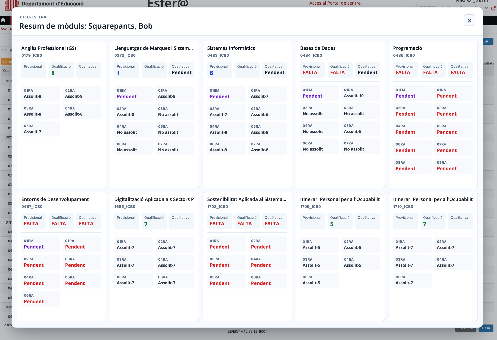

# XTEC-Esfera

Extensió de Chrome per consultar ràpidament un resum de qualificacions dins les pàgines d’avaluació d’XTEC-Esfera.

L’extensió afegeix un botó **Resum** a la pantalla que mostra una finestra gran amb els mòduls, les qualificacions principals i els resultats d’aprenentatge.

El mode **Resum** és només informatiu. El mode **Edició** és una funcionalitat provisional: pot omplir camps del formulari original d’XTEC-Esfera, però cal revisar manualment tots els canvis a la pàgina abans de prémer el botó oficial **Desa**.

> "Nota": Com a funcionalitat extra, detecta quan la pàgina no s'ha expandit horitzontalment i mostra un botó "Expandir" per arreglar-la.

## Instal·lació

1. Descarrega el fitxer [XTEC-Esfera.zip](https://github.com/optimisme/XTEC-Esfera/raw/refs/heads/main/XTEC-Esfera.zip).
2. Descomprimeix el fitxer `.zip` i guarda la carpeta descomprimida en un lloc no temporal, per exemple a `Documents` o a una carpeta d’aplicacions.
3. Obre una pestanya nova a Chrome i escriu a la barra d’adreces: `chrome://extensions`.
4. Activa el **Mode de desenvolupador**. (A dalt a la dreta)
5. Prem **Carrega una extensió desempaquetada**.
6. Selecciona la carpeta descomprimida, la que conté el fitxer `manifest.json`.
7. Obre una pàgina de "Qualificacions per grup i alumne" compatible d’XTEC-Esfera i prem el botó **Resum**.

Chrome no instal·la extensions arrossegant directament un fitxer `.zip` en mode desenvolupador. Primer cal descomprimir-lo i carregar la carpeta desempaquetada.

## Desenvolupament

El codi font de l’extensió és a la carpeta [src](src).

La versió empaquetada és el fitxer [XTEC-Esfera.zip](https://github.com/optimisme/XTEC-Esfera/raw/refs/heads/main/XTEC-Esfera.zip). La versió actual de l’extensió és `0.1.1`.
