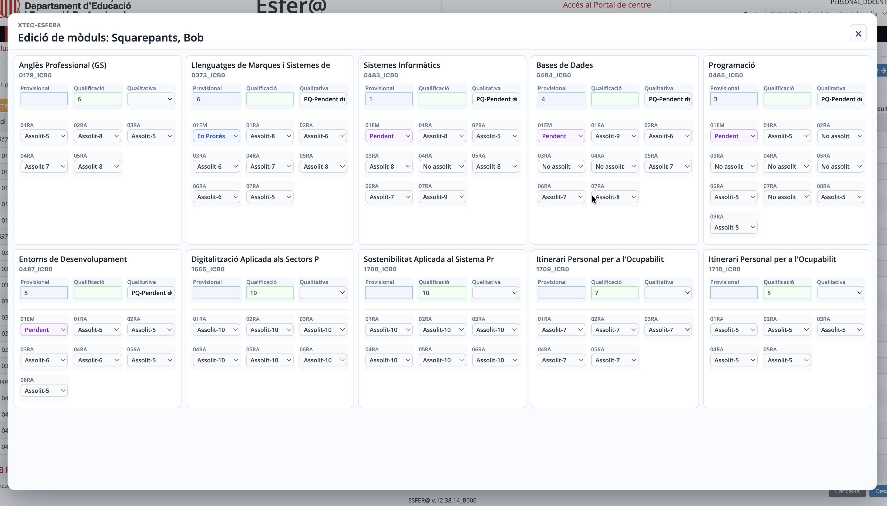

# XTEC-Esfera

Extensió per Chrome i Firefox per obrir ràpidament un panell d'edició de qualificacions dins les pàgines d'avaluació d'XTEC-Esfera.

L'extensió afegeix un botó **Panell d'edició** a la pantalla que mostra una finestra gran amb els mòduls, les qualificacions principals i els resultats d'aprenentatge. El panell s'obre directament en mode edició.


El panell d'edició permet omplir camps del formulari original d'XTEC-Esfera, per seguretat cal revisar els canvis abans de prémer el botó **Desa**.

Els camps de qualificació del panell utilitzen colors per facilitar la revisió visual. 



> "Nota": Com a funcionalitat extra, detecta quan la pàgina no s'ha expandit horitzontalment i mostra un botó "Expandir" per arreglar-la.

## Descàrrega

- [Versió Chrome](https://github.com/optimisme/XTEC-Esfera/raw/refs/heads/main/XTEC-Esfera-chrome.zip)
- [Versió Firefox](https://github.com/optimisme/XTEC-Esfera/raw/refs/heads/main/XTEC-Esfera-firefox.zip)

## Instal·lació Chrome

1. Descarrega el fitxer [XTEC-Esfera-chrome.zip](https://github.com/optimisme/XTEC-Esfera/raw/refs/heads/main/XTEC-Esfera-chrome.zip).
2. Descomprimeix el fitxer `.zip` i guarda la carpeta descomprimida en un lloc no temporal, per exemple a `Documents` o a una carpeta d’aplicacions.
3. Obre una pestanya nova a Chrome i escriu a la barra d’adreces: `chrome://extensions`.
4. Activa el **Mode de desenvolupador**. (A dalt a la dreta)
5. Prem **Carrega una extensió desempaquetada**.
6. Selecciona la carpeta descomprimida, la que conté el fitxer `manifest.json`.
7. Obre una pàgina de "Qualificacions per grup i alumne" compatible d'XTEC-Esfera i prem el botó **Panell d'edició**.

Chrome no instal·la extensions arrossegant directament un fitxer `.zip` en mode desenvolupador. Primer cal descomprimir-lo i carregar la carpeta desempaquetada.

## Instal·lació Firefox

1. Descarrega el fitxer [XTEC-Esfera-firefox.zip](https://github.com/optimisme/XTEC-Esfera/raw/refs/heads/main/XTEC-Esfera-firefox.zip).
2. Descomprimeix el fitxer `.zip` i guarda la carpeta descomprimida en un lloc no temporal.
3. Obre Firefox i escriu a la barra d'adreces: `about:debugging#/runtime/this-firefox`.
4. Prem **Carrega un complement temporal...**.
5. Selecciona el fitxer `manifest.json` de la carpeta descomprimida.
6. Obre una pàgina de "Qualificacions per grup i alumne" compatible d'XTEC-Esfera i prem el botó **Panell d'edició**.

## Desenvolupament

El codi font de l’extensió és a la carpeta [src](src).

Per generar els paquets de Chrome i Firefox, executa:

```sh
scripts/package.sh
```
